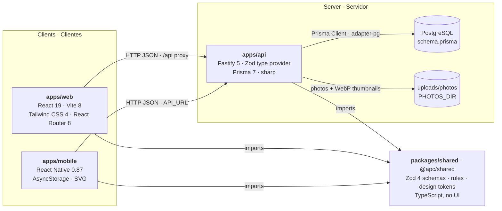
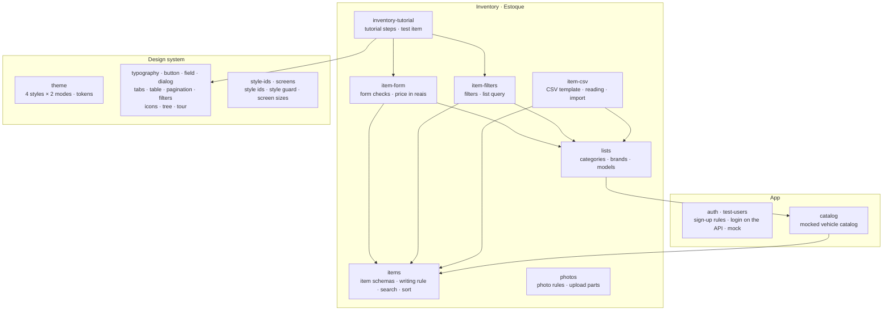
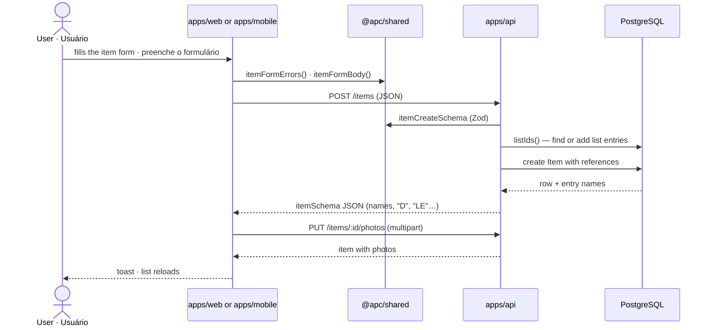
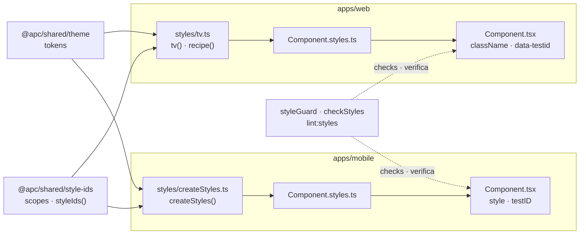

# Architecture · Arquitetura

[🇺🇸 English](#-english-us) · [🇧🇷 Português](#-português-brasil)

APC Universal Repair is a **pnpm + Turborepo** monorepo: a web app and a mobile app built on one shared package, talking to one API over HTTP. The database is described in [database.md](database.md).

O APC Universal Repair é um monorepo **pnpm + Turborepo**: um app web e um app para celular feitos sobre um pacote compartilhado, conversando com uma API por HTTP. O banco está descrito em [database.md](database.md).

## Overview · Visão geral

## Shared package · Pacote compartilhado

Everything web, mobile and API must agree on lives in `@apc/shared`, imported by subpath (e.g. `@apc/shared/items`).

Tudo em que web, celular e API precisam concordar fica no `@apc/shared`, importado por subcaminho (ex.: `@apc/shared/items`).

## Saving an item · Salvando um item

## Styles · Estilos

Each component keeps its look in a recipe in its own `<Component>.styles.ts`, built from the theme tokens, which gives the classes or styles and the style id of each element. Lint fails when a component writes a style or an id by hand.

Cada componente guarda a aparência numa receita no seu próprio `<Componente>.styles.ts`, feita dos tokens do tema, que dá as classes ou estilos e o id de estilo de cada elemento. O lint falha quando um componente escreve um estilo ou um id à mão.

| Scope · Escopo | Covers · Cobre |
|---|---|
| `common` | The design system · O design system |
| `auth` | The login · O login |
| `dashboard` | The shell around the tabs · A moldura em volta das abas |
| `catalog` | The Catalog tab · A aba Catálogo |
| `inventory` | The Inventory tab and its dialogs · A aba Estoque e seus diálogos |
| `docs` | Storybook-only pages · Páginas só do Storybook |

An id reads `<scope>.<component>[.<slot>…]`, e.g. `common.dialog.header.close`, the same on web and mobile. See "Styles" in [AGENTS.md](../AGENTS.md).

Um id é `<escopo>.<componente>[.<slot>…]`, ex.: `common.dialog.header.close`, igual na web e no celular. Veja "Styles" no [AGENTS.md](../AGENTS.md).

---

## 🇺🇸 English (US)

### Parts

| Part | What it does | Main technologies |
|---|---|---|
| `packages/shared` | The contract and the rules: Zod schemas of every request and response, the writing rule, search and sort, form checks, CSV reading, design tokens of the 4 styles and 2 modes. No UI, so web and mobile behave the same. | TypeScript, Zod 4 |
| `apps/web` | The web app: login and sign-up, Dashboard with the Inventory and Catalog tabs, design system components. | React 19, Vite 8, Tailwind CSS 4, React Router 8, Storybook 10 |
| `apps/mobile` | The phone app, the same screens with React Native components. | React Native 0.87, AsyncStorage, react-native-svg, image and document pickers |
| `apps/api` | The REST API: users (sign-up and login), items, item lists, photos, CSV import. Validates every request with the shared schemas. | Fastify 5, Prisma 7 (PostgreSQL, adapter-pg), sharp, @fastify/multipart |
| PostgreSQL | Users, items, lists and photo records. Photo files stay on disk under `PHOTOS_DIR`. | PostgreSQL, Prisma migrations |

### How they talk

- Web and mobile call the API over HTTP with JSON; the web goes through the Vite dev server's `/api` proxy, the phone straight to `API_URL`.
- Both sides use the same Zod schemas from `@apc/shared`, so a field can't mean one thing in the app and another in the API.
- The API speaks names (`"Motor"`, `"D"`); the database keeps references and enums (see [database.md](database.md)).
- Sign-up (`POST /users`) and login (`POST /sessions`) go to the API, which keeps the users and checks the password against its hash; the app saves the user it answers with as the session on the device. Real sessions, with tokens the API checks, come with EP-10.

### Tooling

| Concern | Tool |
|---|---|
| Monorepo, tasks and cache | pnpm 12 workspaces, Turborepo 2 |
| Language | TypeScript 5–6 |
| Lint | ESLint with typescript-eslint (shared, API, mobile), oxlint (web), and the style guard (`lint:styles`) on web and mobile |
| Shared and API tests | Node test runner (`node --test`, `tsx --test`) |
| Web component tests | Vitest 5 Browser Mode in Chromium |
| Web end-to-end tests | Playwright, at 1280×720 and 360×780 |
| Mobile tests | Jest with react-test-renderer |
| Design system catalog | Storybook 10 |
| Style recipes | tailwind-variants with tailwind-merge (web), `createStyles` over `StyleSheet` (mobile), both giving style ids |
| CI | GitHub Actions: lint, typecheck, build, tests and E2E on every pull request |

---

## 🇧🇷 Português (Brasil)

### Partes

| Parte | O que faz | Principais tecnologias |
|---|---|---|
| `packages/shared` | O contrato e as regras: schemas Zod de cada requisição e resposta, a regra de escrita, busca e ordenação, as validações do formulário, a leitura do CSV e os tokens de design dos 4 estilos e 2 modos. Sem interface, para web e celular funcionarem igual. | TypeScript, Zod 4 |
| `apps/web` | O app web: login e cadastro, Dashboard com as abas Estoque e Catálogo, componentes do design system. | React 19, Vite 8, Tailwind CSS 4, React Router 8, Storybook 10 |
| `apps/mobile` | O app para celular, com as mesmas telas em componentes React Native. | React Native 0.87, AsyncStorage, react-native-svg, seletores de imagem e de documentos |
| `apps/api` | A API REST: usuários (cadastro e login), itens, listas, fotos e importação de CSV. Valida cada requisição com os schemas compartilhados. | Fastify 5, Prisma 7 (PostgreSQL, adapter-pg), sharp, @fastify/multipart |
| PostgreSQL | Usuários, itens, listas e os registros das fotos. Os arquivos das fotos ficam em disco, em `PHOTOS_DIR`. | PostgreSQL, migrações do Prisma |

### Como conversam

- Web e celular chamam a API por HTTP com JSON; a web passa pelo proxy `/api` do servidor do Vite, o celular vai direto ao `API_URL`.
- Os dois lados usam os mesmos schemas Zod do `@apc/shared`, então um campo não pode significar uma coisa no app e outra na API.
- A API fala em nomes (`"Motor"`, `"D"`); o banco guarda referências e enums (veja [database.md](database.md)).
- O cadastro (`POST /users`) e o login (`POST /sessions`) vão para a API, que guarda os usuários e confere a senha com o hash dela; o app salva o usuário que ela responde como a sessão no aparelho. Sessões de verdade, com tokens conferidos pela API, vêm com o EP-10.

### Ferramentas

| Assunto | Ferramenta |
|---|---|
| Monorepo, tarefas e cache | workspaces do pnpm 12, Turborepo 2 |
| Linguagem | TypeScript 5–6 |
| Lint | ESLint com typescript-eslint (shared, API, celular), oxlint (web), e a verificação de estilos (`lint:styles`) na web e no celular |
| Testes do shared e da API | Test runner do Node (`node --test`, `tsx --test`) |
| Testes de componente da web | Vitest 5 Browser Mode no Chromium |
| Testes de ponta a ponta da web | Playwright, em 1280×720 e 360×780 |
| Testes do celular | Jest com react-test-renderer |
| Catálogo do design system | Storybook 10 |
| Receitas de estilo | tailwind-variants com tailwind-merge (web), `createStyles` sobre o `StyleSheet` (celular), as duas dando os ids de estilo |
| CI | GitHub Actions: lint, typecheck, build, testes e E2E em todo pull request |
