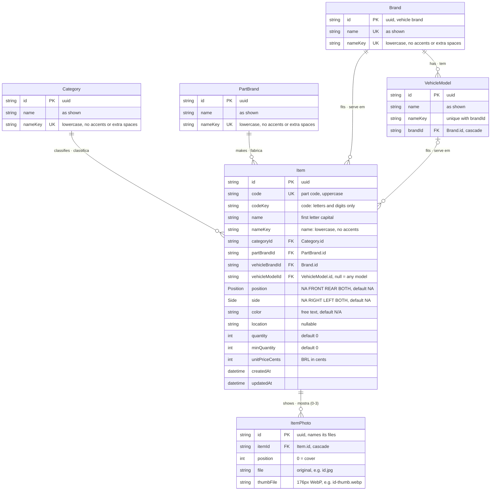

# Database · Banco de dados

[🇺🇸 English](#-english-us) · [🇧🇷 Português](#-português-brasil)

The inventory's PostgreSQL database, defined in [`apps/api/prisma/schema.prisma`](../apps/api/prisma/schema.prisma) and changed only through the migrations in [`apps/api/prisma/migrations`](../apps/api/prisma/migrations).

O banco PostgreSQL do estoque, definido em [`apps/api/prisma/schema.prisma`](../apps/api/prisma/schema.prisma) e alterado só pelas migrações em [`apps/api/prisma/migrations`](../apps/api/prisma/migrations).

## Diagram · Diagrama

---

## 🇺🇸 English (US)

### Entities

| Table | What it holds |
|---|---|
| `Item` | An inventory item: a part in stock, with its part code, the list entries it belongs to, where it fits on the vehicle, how many there are and its unit price. |
| `ItemPhoto` | Up to 3 photos of an item, in order; the first one is the cover in the list. The files themselves are stored by the API under `PHOTOS_DIR`. |
| `Category` | The categories an item is filed under (Motor, Freios…). |
| `PartBrand` | The brands of the parts (Bosch, NGK…). |
| `Brand` | The vehicle brands (Chevrolet, Volkswagen…), shared with the catalog. |
| `VehicleModel` | The models of each vehicle brand (Opala, Gol…). |

### Relationships

- Every item has **one** category, part brand and vehicle brand, and **at most one** vehicle model. An item without a vehicle model fits **any model** of its vehicle brand.
- A vehicle model belongs to **one** vehicle brand; a vehicle brand has **many** models.
- An item has **0 to 3** photos (the limit is checked by the API).
- The item stores **references** (`categoryId`, …), not names: renaming a list entry renames it on every item at once.

### Rules

| Rule | Where |
|---|---|
| Names are unique ignoring case, accents and extra spaces: `nameKey` holds the name in that form and is unique (a vehicle model's within its brand). | `Category`, `PartBrand`, `Brand`, `VehicleModel` |
| A part code is unique and stored in uppercase; `codeKey` and `nameKey` let the search ignore separators and accents. | `Item` |
| The unit price is an integer in cents, so prices add up without rounding errors. | `Item.unitPriceCents` |
| `position`, `side` and `color` default to "not applicable". The API speaks `N/A`, `D`, `T`, `Ambos` (position) and `N/A`, `LD`, `LE`, `Ambos` (side); the database keeps them as the `Position` and `Side` enums. | `Item` |
| Stock status isn't stored: an item is out of stock at 0 and low at or under its minimum. | `Item.quantity`, `Item.minQuantity` |
| A list entry an item uses can't be deleted (`RESTRICT`); deleting a vehicle brand deletes its models (`CASCADE`); deleting an item deletes its photos (`CASCADE`). | Foreign keys |
| Vehicle brands of the catalog can't be deleted from the inventory. | API |

### Starting data

`pnpm --filter @apc/api db:seed` fills a new database with the default categories, part brands, vehicle brands with their models and a few sample items. It can run again without duplicating anything.

---

## 🇧🇷 Português (Brasil)

### Entidades

| Tabela | O que guarda |
|---|---|
| `Item` | Um item do estoque: uma peça, com o código da peça, as entradas das listas a que pertence, onde serve no veículo, quantas há e o valor unitário. |
| `ItemPhoto` | Até 3 fotos de um item, em ordem; a primeira é a capa na lista. Os arquivos ficam guardados pela API em `PHOTOS_DIR`. |
| `Category` | As categorias dos itens (Motor, Freios…). |
| `PartBrand` | As marcas das peças (Bosch, NGK…). |
| `Brand` | As marcas de veículo (Chevrolet, Volkswagen…), as mesmas do catálogo. |
| `VehicleModel` | Os modelos de cada marca de veículo (Opala, Gol…). |

### Relacionamentos

- Todo item tem **uma** categoria, marca de peça e marca de veículo, e **no máximo um** modelo de veículo. Um item sem modelo serve em **qualquer modelo** da marca.
- Um modelo pertence a **uma** marca de veículo; uma marca tem **vários** modelos.
- Um item tem de **0 a 3** fotos (o limite é conferido pela API).
- O item guarda **referências** (`categoryId`, …), não nomes: renomear uma entrada de lista renomeia em todos os itens de uma vez.

### Regras

| Regra | Onde |
|---|---|
| Os nomes são únicos ignorando maiúsculas, acentos e espaços a mais: `nameKey` guarda o nome nessa forma e é único (o de um modelo, dentro da marca). | `Category`, `PartBrand`, `Brand`, `VehicleModel` |
| O código da peça é único e guardado em maiúsculas; `codeKey` e `nameKey` deixam a busca ignorar separadores e acentos. | `Item` |
| O valor unitário é um inteiro em centavos, para os valores somarem sem erro de arredondamento. | `Item.unitPriceCents` |
| `position`, `side` e `color` começam como "não se aplica". A API usa `N/A`, `D`, `T`, `Ambos` (posição) e `N/A`, `LD`, `LE`, `Ambos` (lado); o banco guarda nos enums `Position` e `Side`. | `Item` |
| A situação do estoque não é guardada: o item está esgotado em 0 e baixo quando está no mínimo ou abaixo. | `Item.quantity`, `Item.minQuantity` |
| Uma entrada de lista usada por um item não pode ser excluída (`RESTRICT`); excluir uma marca de veículo exclui os modelos dela (`CASCADE`); excluir um item exclui as fotos dele (`CASCADE`). | Chaves estrangeiras |
| As marcas de veículo do catálogo não podem ser excluídas pelo estoque. | API |

### Dados iniciais

`pnpm --filter @apc/api db:seed` preenche um banco novo com as categorias, marcas de peça, marcas de veículo com seus modelos e alguns itens de exemplo. Pode rodar de novo sem duplicar nada.
